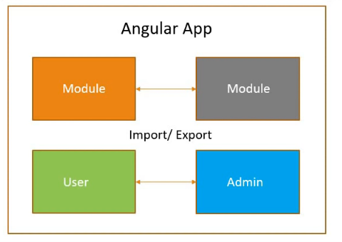
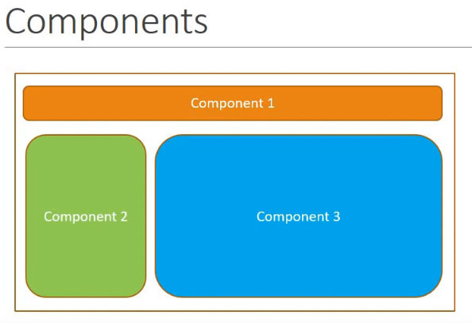

## Angular설치
https://cli.angular.io/
```
$ npm install -g @angular/cli
$ ng new my-dream-app
$ cd my-dream-app
$ ng serve
```
## 프로젝트 만들기
```
$ ng new 프로젝트명
```
## serve하기?
```
$ ng serve
```

## 아래의 주소로 접속
http://localhost:4200


# 모듈


# 컴포넌트

컴포넌트는 세가지로 나눌 수 있다.
1. View : Html 
2. Class : Code, TypeScript, Data&Method (해당 DOM을 숨기거나 나타내는 등)
3. Metadata : information, decorator


# 요약
Angular app - 하나 또는 많은 Module들이 있다.
Module - 하나 또는 많은 Component들과 service들이 있다.
Component - HTML + Class
Service - 비즈니스 로직
모듈들은 브라우저에서 상호작용과 뷰 렌더링을 한다.


app.component.ts를 보자
```js
//컴포넌트는 메타데이터와 템플릿(뷰를 나타내는)
@Component({ // 데코레이터 앵귤러에게 이건 비어있는 클래스가 아니야. 
  selector: 'app-root',  //app-root 태그를 선택한 뒤,
  templateUrl: './app.component.html', // 이것을 표시해준다.
  styleUrls: ['./app.component.css']
})
//클래스가 하나 있고 프로퍼티는 title 메소드는 없다.
export class AppComponent {
  title = 'hello-world'; //app.component.html에 있는 {{title}}에 들어간다.
}
```

### index.html
```html
<!doctype html>
<html lang="en">
<head>
  <meta charset="utf-8">
  <title>HelloWorld</title>
  <base href="/">
  <meta name="viewport" content="width=device-width, initial-scale=1">
  <link rel="icon" type="image/x-icon" href="favicon.ico">
</head>
<body>
  <app-root></app-root>  <!-- selector: 'app-root' -->
</body>
</html>
```
### app.component.html
```html
<span>{{ title }} app is running!</span>
```