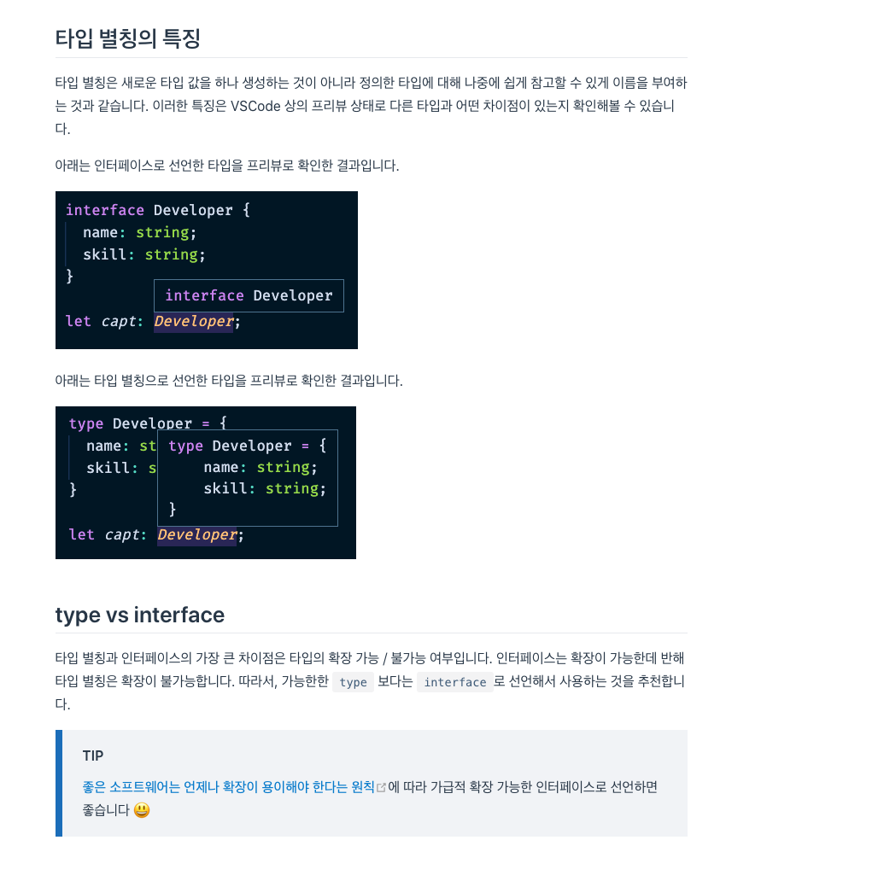

https://heropy.blog/2020/01/27/typescript/
타입스크립트 고급 문법
https://medium.com/harrythegreat/typescript-%EC%9C%A0%ED%8B%B8%EB%A6%AC%ED%8B%B0-%ED%81%B4%EB%9E%98%EC%8A%A4-%ED%8C%8C%ED%97%A4%EC%B9%98%EA%B8%B0-7ae8a786fb20

# 설치

npm init -y
npm i -D webpack webpack-cli 
npm i -D typescript ts-loader source-map-loader

# Types vs Interface

Type과 Interface의 차이가 있었지만 Typescript가 최신버젼으로 올수록 점점 더 비슷해지고 있습니다.
Interface는 객체와 같이 데이터의 모양을 나타낼때 사용됩니다.
Type은 데이터의 타입을 정의할때 사용됩니다. 예를들어 union, primitive, intersection, tuple 등등

## Declaration merging

```ts
interface Song {
  artistName: string;
};

interface Song {
  songName: string;
};

const song: Song = {
  artistName: "Freddie",
  songName: "The Chain"
};
```

Type의 경우 에러가 발생합니다.


https://blog.logrocket.com/types-vs-interfaces-in-typescript/


타입 스크립트의 타입 가변성 (공변, 반공변)
https://velog.io/@vnthf/%ED%83%80%EC%9E%85%EC%8A%A4%ED%81%AC%EB%A6%BD%ED%8A%B8%EC%9D%98-%ED%83%80%EC%9E%85%EA%B0%80%EB%B3%80%EC%84%B1
https://medium.com/@michalskoczylas/covariance-contravariance-and-a-little-bit-of-typescript-2e61f41f6f68

typescript 고급
https://rinae.dev/posts/practical-advanced-typescript-summary


keyof typeof를 써야하는 이유
https://stackoverflow.com/questions/55377365/what-does-keyof-typeof-mean-in-typescript

### Enum 실제 사용
```ts

enum LogLevel {
  ERROR, WARN, INFO, DEBUG
}

// 'ERROR' | 'WARN' | 'INFO' | 'DEBUG';
type LogLevelStrings = keyof typeof LogLevel;

function printImportant(key: LogLevelStrings, message: string) {
    const num = LogLevel[key];
    if (num <= LogLevel.WARN) {
       console.log('Log level key is: ', key);
       console.log('Log level value is: ', num);
       console.log('Log level message is: ', message);
    }
}
printImportant('ERROR', 'This is a message');
```

### 제네릭 제약 조건
```ts
interface LengthWise {
  length: number;
}

function logText<T extends LengthWise>(text: T): T {
  console.log(text.length);
  return text;
}

logText(10); // Error, 숫자 타입에는 `length`가 존재하지 않으므로 오류 발생
logText({ length: 0, value: 'hi' }); // `text.length` 코드는 객체의 속성 접근과 같이 동작하므로 오류 없음
```

```ts
function getProperty<T, O extends keyof T>(obj: T, key: O) {
  return obj[key];  
}
let obj = { a: 1, b: 2, c: 3 };

getProperty(obj, "a"); // okay
getProperty(obj, "z"); // error: "z"는 "a", "b", "c" 속성에 해당하지 않습니다.
```




## Ambient declarations
https://medium.com/@elfi_y/typescript-ambient-module-8816c9e5d426

### declaration and definition
https://devpaul.github.io/ambient-declarations-slides


The declaration describes the shape of a variable, interface, class
```ts
declare const map: { [ key: string ]: string };
```
The definition is the actual implementation
```ts
const map = {
	one: 1,
	two: 2
};
```

https://stackoverflow.com/questions/34985552/typescript-import-vs-declare-var-with-type-definitions


import * as d3 from 'd3/d3'; should work fine with the type system (without the ///<reference .../>) as long as the compiler options are correct, and the folder structure is correct in the typings folder.

declare var d3 is how to declare a variable that exists somewhere in the JS. Think of it like "Yeah, yeah typescript, quit complaining, trust me it exists".

import {Component} from 'angular2/core'; is how to pull a specific piece from a module. In node terms this translates to var Component = require('angular2/core').Component;

The important compiler option to have on is "moduleResolution": "node", which should already be on for angular2 to function.

So if d3 was installed as a node_module then you should be able to simply use:

npm install d3
tsd install d3
tsc
and it should just work.

If you have installed d3 using bower, then you will need to use a relative path to the module instead.

bower install d3
tsd install d3
then

/// <reference path="../path/to/typings/d3/d3.d.ts" />
import * as d3 from '../path/to/d3';
NOTE: tsd has been deprecated in favor of typings. Use typings install d3 instead.

Additionally you can skip using tsd or typings altogether provided you have a recent version of typescript and npm install --save-dev @types/d3 (this is officially supported by typescript, looking in node_modules/@types/... for typedefs

man... typescript has grown up so much.... :)
