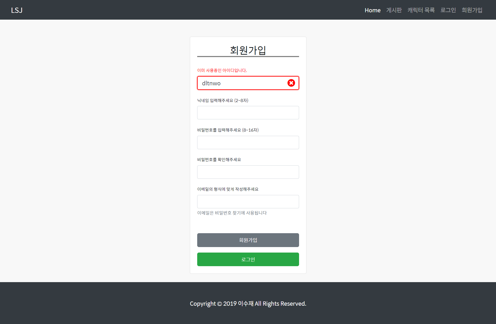
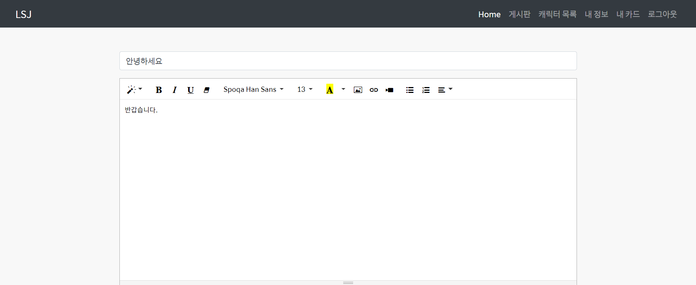
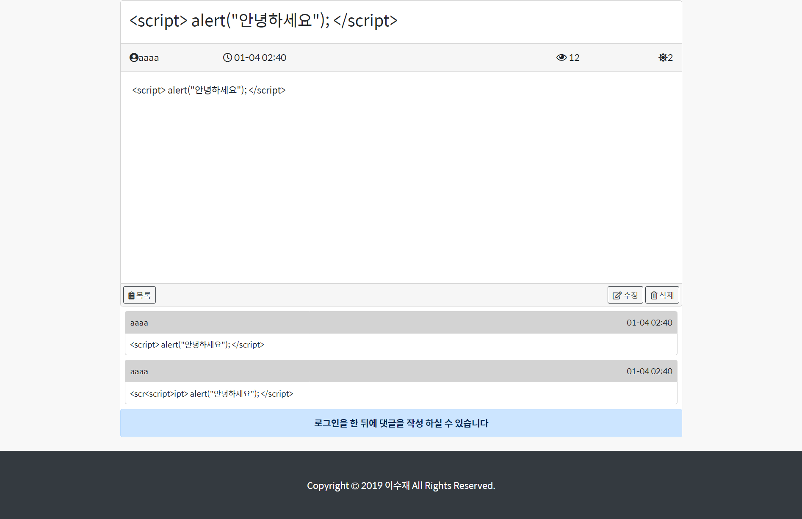
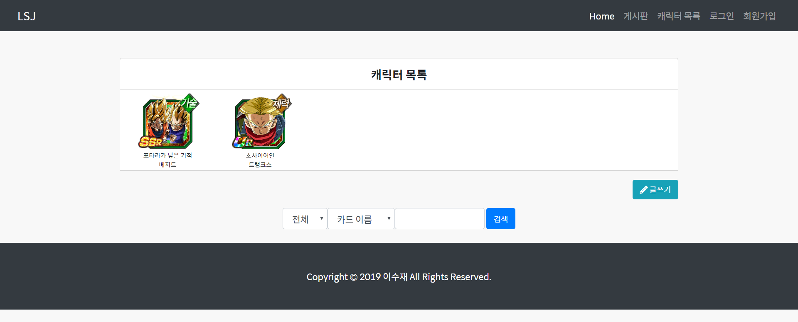
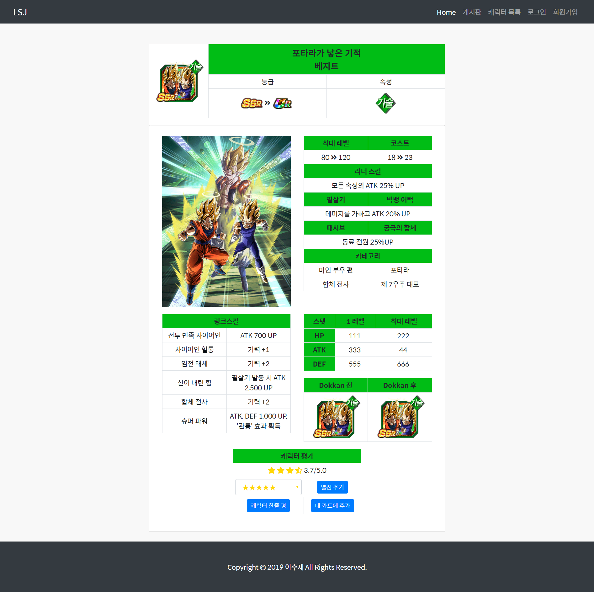
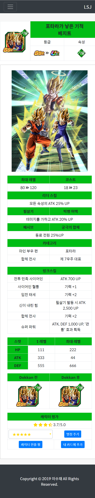
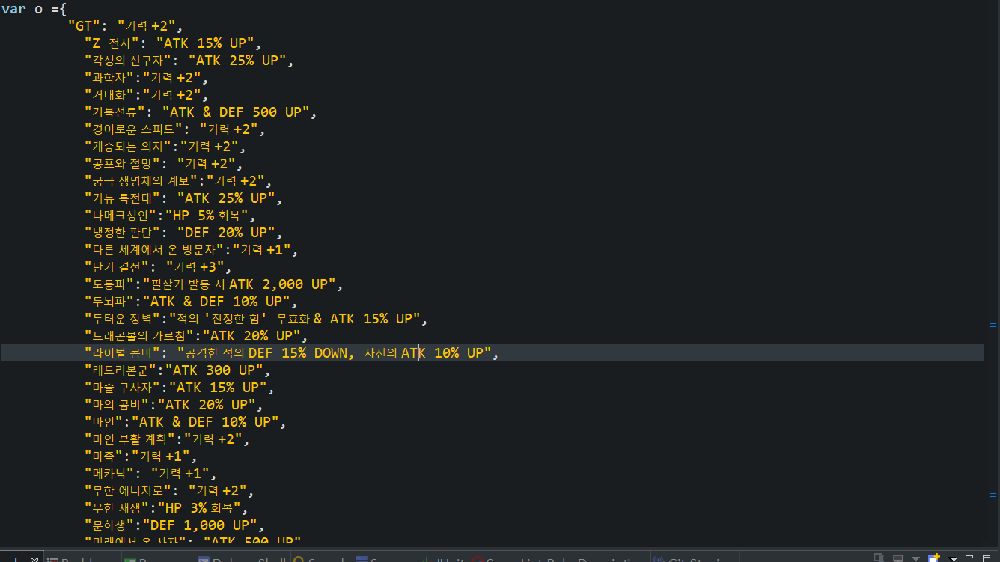

# 드래곤볼 폭렬격전(모바일 게임) 공략 사이트
[프로젝트 소스코드 보기](https://github.com/SooJae/DBB)

# 만들게된 계기
3년전 했던 스마트폰 게임 '드래곤볼 폭렬격전'에 대한 한국 공략사이트가 없어서 일본 공략사이트에 들어가 번역기 돌리면서 정보를 찾던 기억이 있었습니다.   2019년에도 한국 공략사이트가 없는 것을 보고, 직접 공략사이트를 만들어보고 싶었습니다.

# 이 프로젝트로 인해 배운점
- JSP 동작원리
- Summernote 라이브러리 사용법
- Bootstrap 완벽하게 숙지(PC와 모바일에 맞게 화면을 최적화)
- 자바스크립트 객체에 대한 이해

# 개발 환경
## BACK-END
- JAVA
- JSP

## FRONT-END
- HTML
- JAVASCRIPT
- CSS
- JQUERY
- AJAX
- BootStrap
## VERSION CONTROL
- GIT
- GITHUB
## LIBRARY
- JSTL
- summernote
---
## Summernote를 이용한 게시물 작성

회원가입 폼을 만들었지만, ajax통신이 가끔씩 에러가 나는 상황이 발생합니다.

---
## Summernote를 이용한 게시물 작성

Summernote 라이브러리를 이용하여 게시물 작성 폼을 만들었습니다.

---
## 게시물 상세보기와 댓글

게시물의 상세보기와 댓글입니다.

---
## 카드 목록

드래곤볼 폭렬격전의 카드목록 입니다. (2개의 카드에 대한 정보만 넣은 상태 입니다.)

---
## 카드 상세보기

카드 상세보기 창에서 카드에 대한 설명과, 카드에 대한 평가를 할 수 있습니다.

---

## 카드 상세보기 (모바일 최적화)

---

## 카드의 타입에 대한 설명이 담긴 객체

객체의 value값에는 카드의 타입에 대한 설명이 담겨 있습니다.   
반복되는 정보이면서, db에 넣기에는 필요없는 정보이기 때문에 객체에 넣었습니다.    객체의 key값만 db에 넣고, 꺼낼때는 key값을 db로부터 받아와 해당되는 value 값을 갖고옵니다.

---
## 프로젝트가 중단된 이유
이미지 용량이 너무 커서 서버에 올릴 수 없었습니다.   
무료 이미지 업로드 사이트인 imgur 에 올려봤으나, 바로 삭제처리가 됐습니다.      
또한, 일본판 폭렬격전의 업데이트가 6개월 정도 더 빨랐기 때문에 정보력에서 밀렸습니다.  
차라리 일본 사이트에서 번역기 돌려서 정보를 찾는게 더 낫다고 판단하여 중단했습니다.   
만약 제가 일본어를 잘해서 일본판/한국판 각각의 버젼을 만들었으면 중단되지 않았을 것 같습니다.   