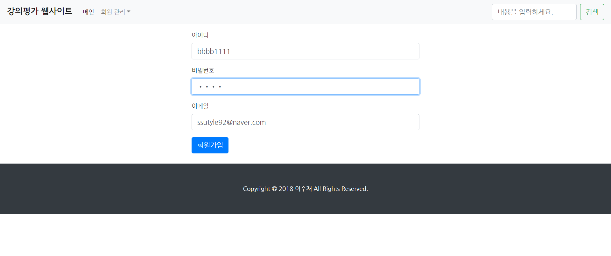
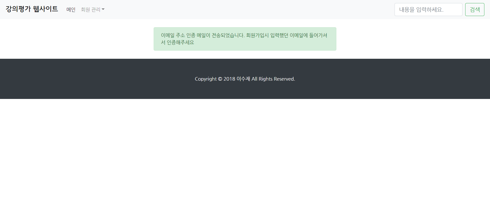
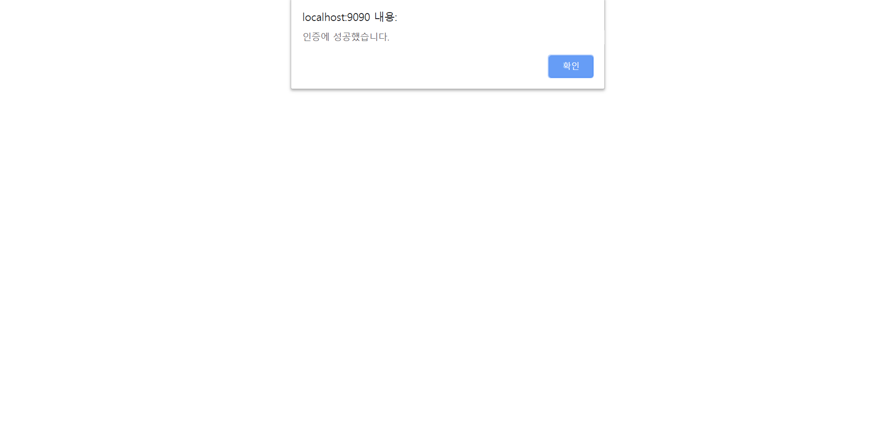
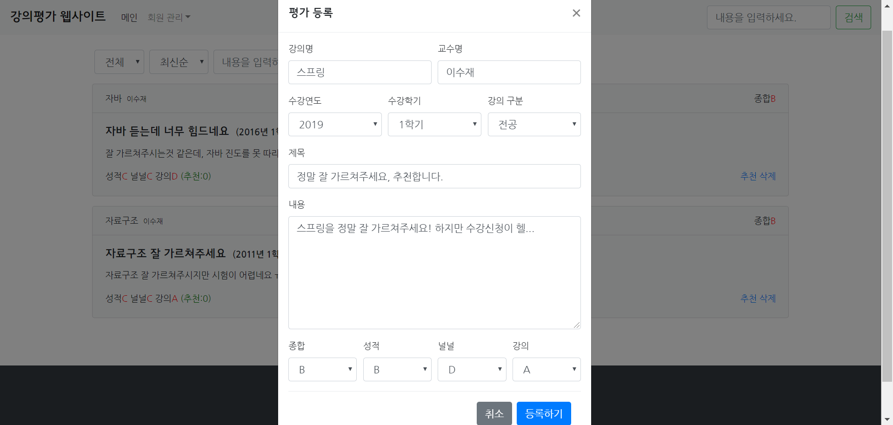
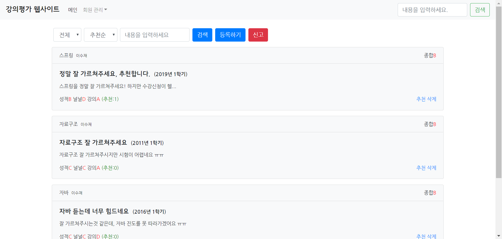
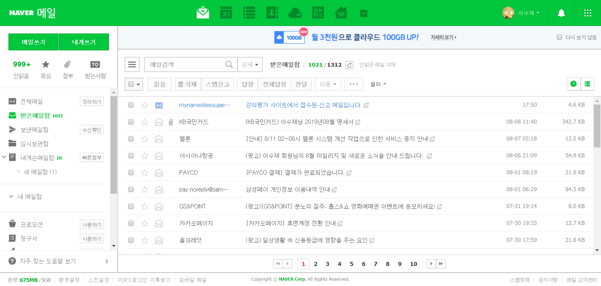

# 강의평가 사이트
[프로젝트 소스코드 보기](https://github.com/SooJae/LectureEvaluation)

# 이 프로젝트로 인해 배운점
- JSP
- SMTP를 이용한 이메일 기능 구현

## SMTP (Simple Mail Transfer Protocal)
메일을 전송하기 위해 사용되는 TCP/IP Protocol 통신규약입니다.

## POP3(Post Office Protocol) / IMAP(Internet Mail Access Protocol)
이메일을 수신하기 위한 표준 Protocol - 서버에 위치한 자신의 메일 수신함을 가져올 수 있습니다.

# 개발 환경
## BACK-END
- JAVA
- JSP

## FRONT-END
- HTML
- JAVASCRIPT
- CSS
- JQUERY
- AJAX
- BootStrap
## VERSION CONTROL
- GIT
- GITHUB
## LIBRARY
- activation.jar
- mail.jar
  

## 회원가입

## 이메일 인증메일 발송(인증을 안할 시 로그인이 안됩니다)

## 이메일 인증메일 재 전송 버튼을 눌렀을 시

## 가입할 때 작성했던 이메일로 인증메일 도착

## 이메일 내용

## 링크 클릭시 이메일 인증 성공

## 강의 평가 작성

## 강의 평가 목록

## 강의 평가글 신고창

## 강의평가글에 대한 신고 이메일이 도착

## 신고 이메일의 내용

