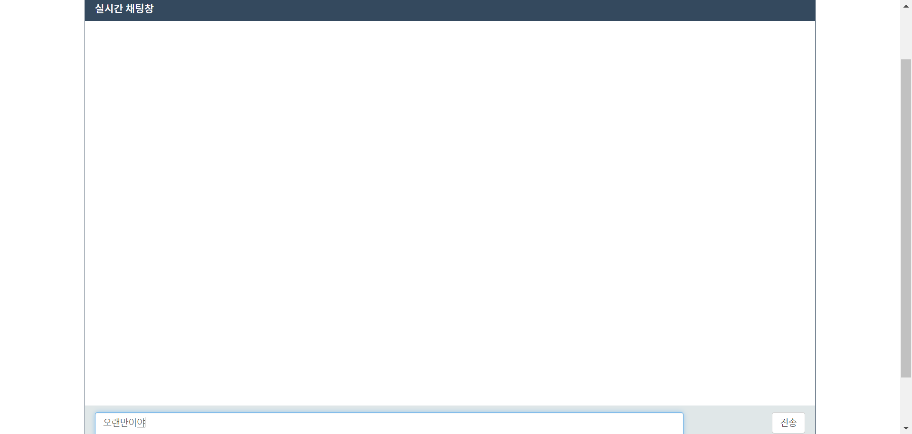
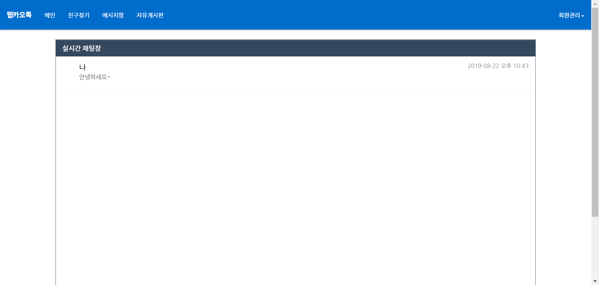
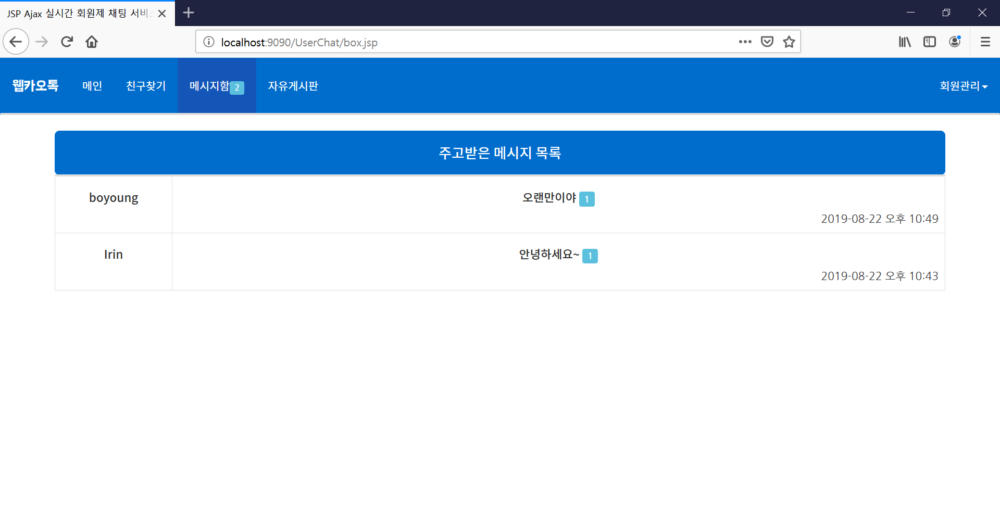
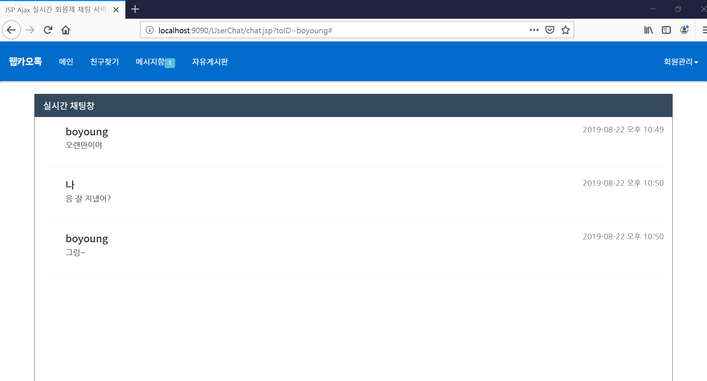
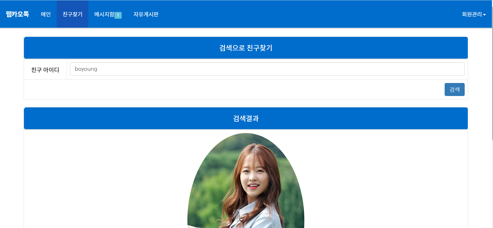
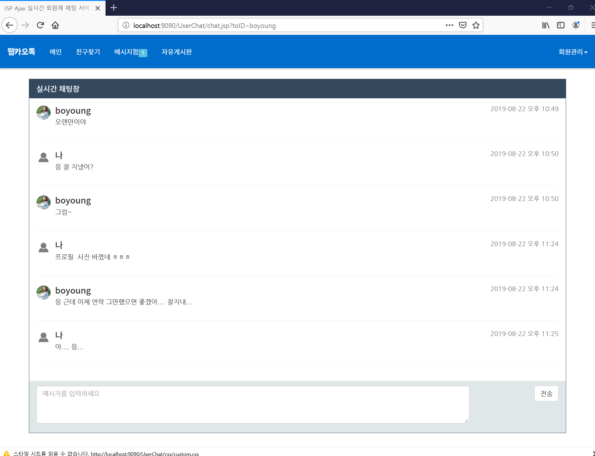

# Ajax통신을 이용한 메신저 웹 사이트
[프로젝트 소스코드 보기](https://github.com/SooJae/WebTalk)

# 이 프로젝트로 인해 배운점
- JSP
- Ajax 통신
- 사진 업로드와 사진 자르기

# 개발 환경
## BACK-END
- JAVA
- JSP

## FRONT-END
- HTML
- JAVASCRIPT
- CSS
- JQUERY
- AJAX
- BootStrap
## VERSION CONTROL
- GIT
- GITHUB
## LIBRARY
- JSTL
- cos.jar
  
## 친구 찾기와 친구추가(이수재를 친구추가)

## 메시지 보내기 (보영)

## 메시지 보내기 (아이린)

## 읽지 않은 메세지 수 표시 (setInterval 함수를 이용하여 4초마다 ajax 실행)

## 보영과의 1:1 대화

## 보영 프로필 사진 올리기

## 친구 찾기에서 보영 검색시 프로필 사진이 나온다

## 메신저 창에서도 적용된 보영이의 프로필 사진

