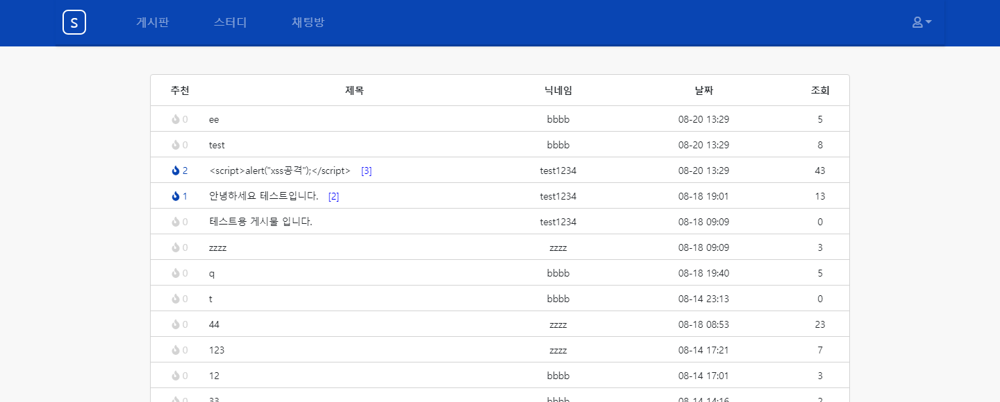
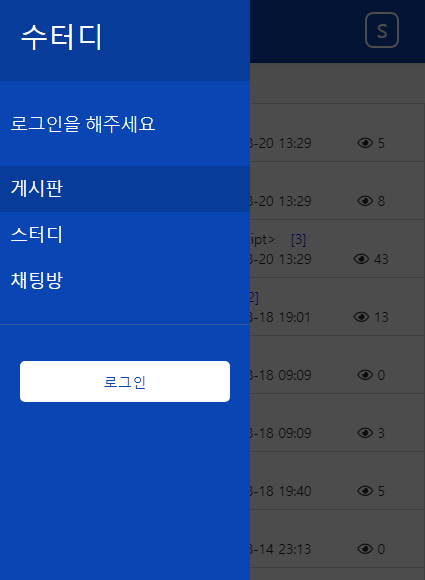
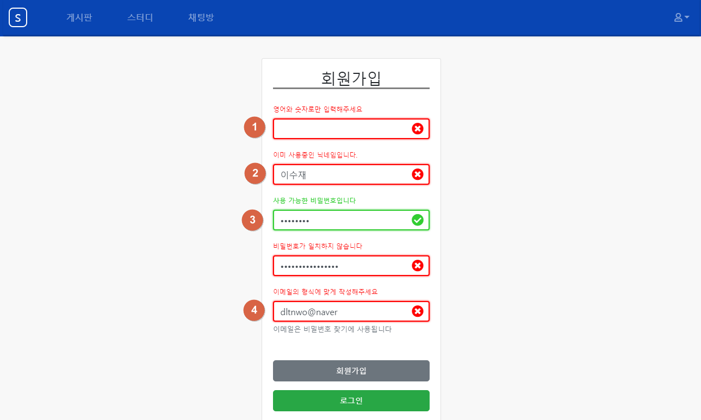
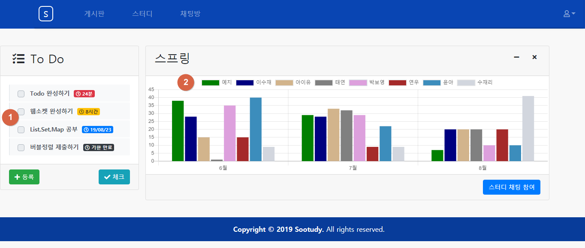

### 1. 네비게이션 바 입니다.
### 2. 몇개의 추천을 받은 게시물인지 나타냅니다. 일정 수 이상 추천을 받은 게시물은 파란색으로 표시됩니다.
### 3. 댓글이 몇개가 달렸는지 확인할 수 있습니다.

### 1. 모바일 버젼입니다. 컴퓨터 버젼과 비교해보면 '닉네임', '날짜', '조회' 부분에 아이콘이 들어간 것을 확인 할 수 있습니다.

### 모바일 버젼에서 네비게이션 바를 펼친 화면 입니다.

### 1. 인기글 버튼을 누르면 일정 수 이상의 추천 받은 게시물만 볼 수 있습니다.
### 2. 검색 기능입니다.

### 1. Ajax 통신을 이용하여 추천을 할 수 있습니다. 이미 추천 했던 게시물을 다시 추천하면 기존의 추천이 취소됩니다.
### 2. 업로드 기능이 있어 게시물을 업로드 할 수 있고, 볼 수 있습니다.
### 3. 댓글 기능이 있으며, Restful 방식으로 ajax 통신합니다.

### 회원가입 폼은 keyup이벤트를 이용하여 타이핑이 실시간으로 폼에 반영되게 했습니다.
### 1. 특수문자를 사용시 정규식과 replace 함수를 이용해 실시간으로 제거해줍니다.
### 2. ajax통신을 이용하여 DB에 중복되는 값이 있는지 확인하고 있으면 실패를 리턴합니다.
### 3. 유효성 검사에 통과가 되면 초록색으로 표시됩니다.
### 4. 비밀번호 확인 값이 비밀번호 값과 달라 실패한 경우입니다.

### 1. 사이트 전체의 alert를 저의 취향에 맞게 커스텀 했습니다. 실패 alert입니다.

### 1. 제가 만든 성공 alert 입니다.
### 2. 가입한 인원 / 최대인원을 확인 할 수 있습니다.
### 3. 진행률을 확인 할 수 있습니다.

### 1. Todo 리스트입니다.  '1시간 이내', '하루 이내', '하루 이상', '시간 초과'시 각각 뱃지 색이 변하도록 만들고, 스크린샷에 보이는 대로 각각 '24분', '8시간',  '19/08/23', '기한 만료' 등 분, 시간, 날짜, 기한만료로 구분하여 나타냅니다.
### 2. 원래의 계획은 Github Api를 이용하여 Commit갯수를 받아와서 그래프로 표현하고 싶었으나 못하고 일단 더미값을 넣어 둔 상태입니다. 그래프는 Chart.js를 사용했습니다.

### Todo 등록 폼입니다. 날짜와 시간등을 선택하여 등록할 수 있습니다.

### 1. 실천한 Todo 항목에 대해서는 체크할 수 있게 했고, 디자인도 변경됩니다.
### 2. 스터디 채팅 화면입니다. 화면에서 보이는 것 같이 접속을 하게되면 이전 대화 목록을 불러옵니다.
### 3. 채팅방에 접속하거나 퇴장할 시 통지를 해줍니다.
### 4. 상대방의 대화창 입니다.
### 5. 사용자의 대화창 입니다. 

### 1. 스터디의 채팅방과 형식은 같지만, 아이디가 필요없는 익명 채팅방을 만들었습니다. SessionStorage를 이용하여 프롬프트에 입력한 아이디를 저장하여 채팅을 참여하고, 채팅방을 나가거나 세션이동시 disconnect와 동시에 SessionStorage안의 아이디 값도 지우도록 만들었습니다. 스터디 채팅방과 달리 이전 대화 목록은 불러오지 않도록 만들었습니다.
### 2. 익명 채팅방 리스트입니다.